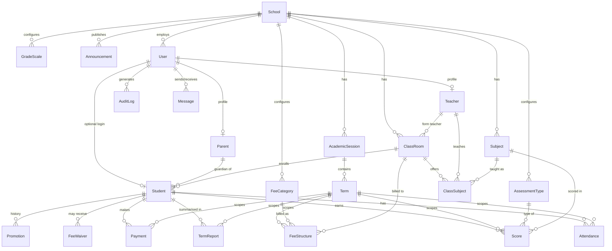

# Carlspat SMS — Database Design

PostgreSQL, managed by Prisma. Schema source: [`server/prisma/schema.prisma`](../server/prisma/schema.prisma).
Baseline SQL migration: [`server/prisma/migrations/0001_init/migration.sql`](../server/prisma/migrations/0001_init/migration.sql).
Seed data: [`server/prisma/seed.ts`](../server/prisma/seed.ts).

```bash
# Apply migrations + seed
cd server
npx prisma migrate deploy
npx prisma db seed
```

## ER Diagram



## Table summary

| Model | Purpose | Key constraints |
|---|---|---|
| `School` | Single-row school profile: name, motto, address, phone, email, logo, head teacher. All editable from the admin UI. | — |
| `AcademicSession` | e.g. `2025/2026`; one `isCurrent` | unique `(schoolId, name)` |
| `Term` | First/Second/Third Term; one `isCurrent` | unique `(sessionId, name)` |
| `AssessmentType` | First Test, Second Test, Assignment, Project, Mid-Term, Final Exam — name/max/order editable; deactivated (not deleted) to preserve history | unique `(schoolId, name)`; UI enforces Σ maxScore = 100 |
| `GradeScale` | A 70–100 Excellent … F 0–39 Fail — fully editable | unique `(schoolId, grade)` |
| `User` | Login accounts for all six roles; bcrypt hash; `tokenVersion` revokes refresh tokens | unique `email` |
| `Teacher` / `Parent` | Role profiles linked 1-1 to `User` | unique `userId`, `staffNo` |
| `Student` | Bio, passport, medical info, academic history, class, parent, status (ACTIVE/GRADUATED/…) | unique `admissionNo` (`CPS/<year>/0001`) |
| `ClassRoom` | Class arm with `level` ordering used for promotion | unique `(schoolId, name, section)` |
| `Subject` / `ClassSubject` | Subjects and per-class teacher assignments | unique `(classRoomId, subjectId)` |
| `Attendance` | One row per student per day: PRESENT / ABSENT / LATE | unique `(studentId, date)` |
| `Score` | One score per student × subject × term × assessment | unique compound of all four |
| `TermReport` | Teacher + head-teacher comments, cached average/position | unique `(studentId, termId)` |
| `Promotion` | Promotion/graduation audit trail | — |
| `FeeCategory` / `FeeStructure` | Categories; amounts per class × term × category | unique `(termId, classRoomId, categoryId)` |
| `FeeWaiver` | Discounts/scholarships per student/term | — |
| `Payment` | Receipt no, amount, method (CASH/BANK_TRANSFER/CARD/ONLINE/POS/CHEQUE), status, gateway reference | unique `receiptNo`, `reference` |
| `Announcement` / `Message` | Broadcasts by audience; direct messages | — |
| `AuditLog` | Who did what, when, from which IP/user-agent | indexed by `createdAt`, `userId` |

## Key derivations (not stored, always computed)

- **Outstanding balance** = Σ `FeeStructure` for the student's class+term − Σ `FeeWaiver` − Σ successful `Payment`. Implemented in `server/src/services/feeService.ts`; powers the report-card lock.
- **Result %, grade, position** — computed from `Score` × active `AssessmentType` against the `GradeScale`, ranked per class with dense ranking (`server/src/services/resultService.ts`).

## Backup & restore

```bash
# Backup (run on the host or via Railway/Render shell)
pg_dump "$DATABASE_URL" --format=custom --file=carlspat-$(date +%F).dump

# Restore
pg_restore --clean --if-exists --dbname "$DATABASE_URL" carlspat-2026-06-11.dump
```

Schedule daily dumps via cron / Railway scheduled jobs and keep at least 30 days off-site (e.g. S3).
